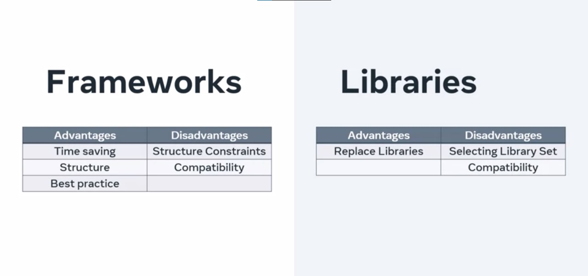

# Libraries vs Frameworks: What's the Difference?

## Libraries: Handy Code Blocks

Libraries are like ready-made tools in a developer's toolbox. Imagine you're building a small e-commerce website, and you need to check if user-provided email addresses are valid. 

This can be a complex task with lots of rules. Instead of figuring it all out yourself, you can use **libraries**. These are pre-built code blocks designed for specific tasks, like email validation.

In our carpenter analogy, libraries are like having specialized tools, such as a pre-made saw or drill, for your woodworking projects. They save you time and effort by handling specific tasks for you.

## Frameworks: Building with a Blueprint

Frameworks are like following a blueprint when building something. Think of a carpenter creating different chair designs. To maintain consistency and efficiency, they use a set of blueprints that specify the chair's dimensions and style. Similarly, **frameworks** provide a structured foundation for developers to build their applications.

In the world of web development, frameworks take care of common tasks like handling web requests and responses. They provide a pre-designed structure, and developers add their own code to fit within this framework. It's like having a blueprint for building chairs, but you can choose the type of wood and add your own unique features.

## Choosing Between Libraries and Frameworks

When deciding between libraries and frameworks, consider how much control and guidance you need:

- **Libraries** give you flexibility. You can pick and choose specific tools to use in your project, but you need to make sure they work together without conflicts.

- **Frameworks** provide structure. They come with pre-defined rules and practices, making development more efficient. However, if your project doesn't fit perfectly within the framework's structure, you might face limitations.

In short, both libraries and frameworks are powerful tools that help developers save time and reduce errors. They let you focus on what makes your project unique, instead of reinventing the wheel. By using these resources, you can speed up your development process and create robust software more easily.
