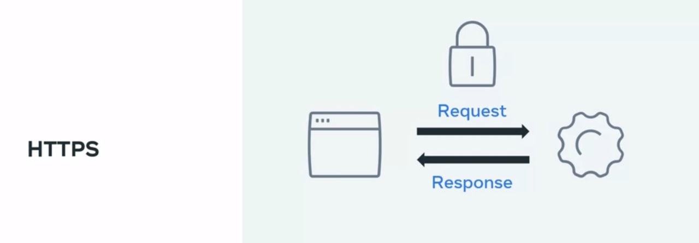
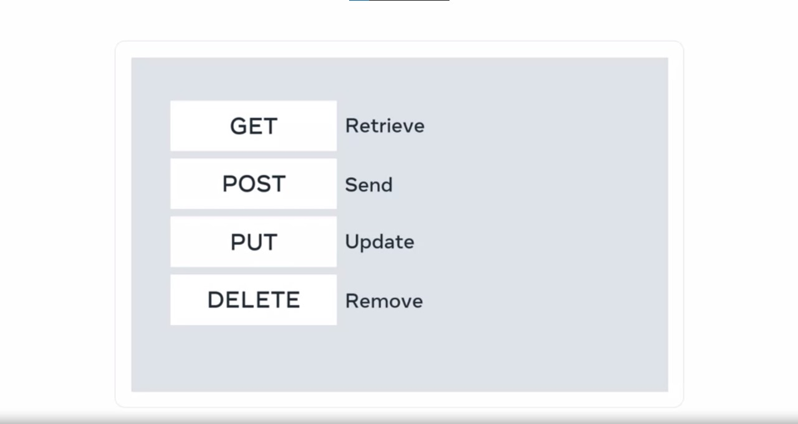
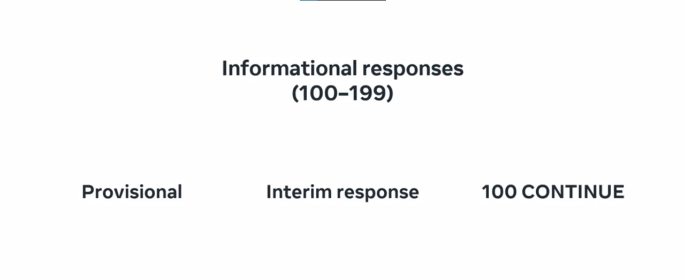
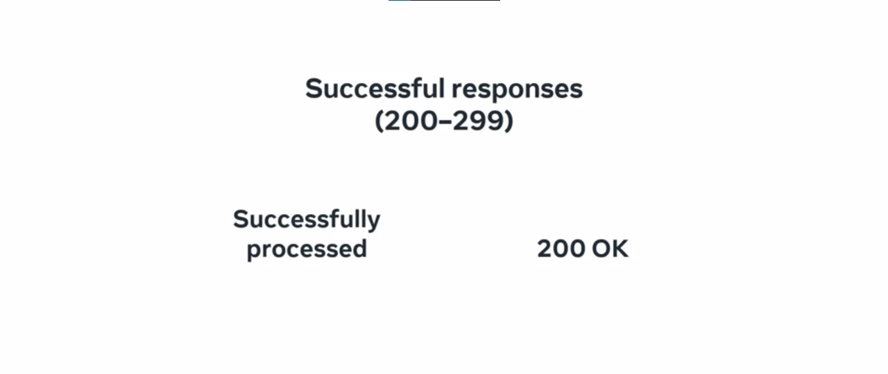
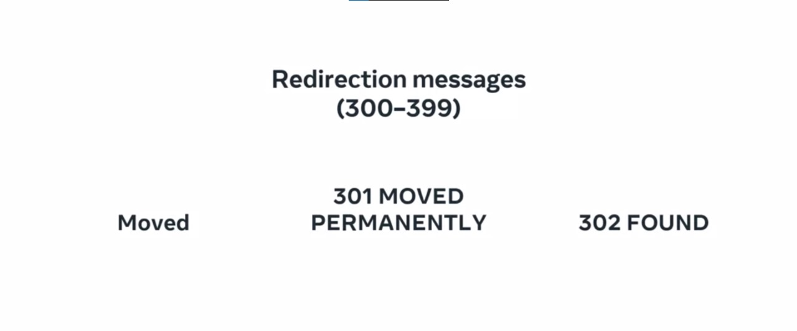
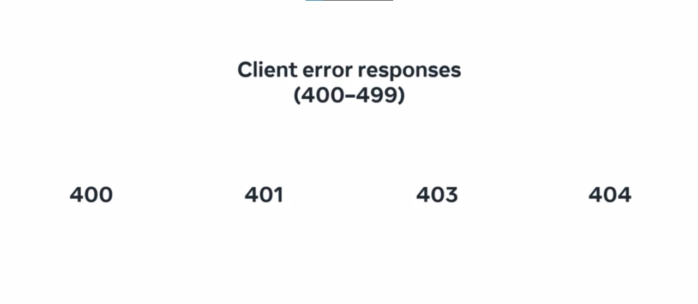
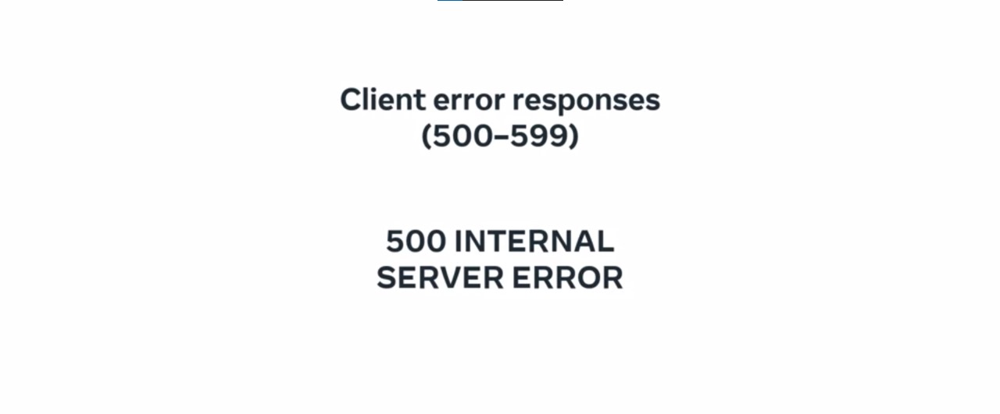

# HTTP

**HTTP (Hypertext Transfer Protocol)** is a fundamental protocol of the World Wide Web, serving as the basis for communication between web browsers and web servers. It enables the transfer of web resources, including HTML documents, images, styles, and other files. HTTP operates on a request-response model, where a client, typically a web browser, sends an HTTP request to a server, and the server responds with an HTTP response.


## HTTP Request Components
An HTTP request comprises the following components:

- **Method**: Describes the action the client must perform. Common methods include GET (retrieve information), POST (send data to the server), PUT (update existing content), and DELETE (remove a resource).
- **Path**: Represents the location of the resource on the web server. It is essential for specifying the exact file or resource to retrieve.
- **Version**: Indicates the version of the HTTP protocol used for the request.
- **Headers**: Contain additional information about the request and the client making it.
- **Body**: Included for certain methods, such as POST and PUT, where the client sends data to the server.

## HTTP Response Components
An HTTP response mirrors the structure of a request, containing:

- **Status Line**: Shows if the HTTP request was successful or if an error occurred. It includes the protocol version, status code, and a reason phrase.
- **Status Code**: A three-digit number that categorizes the response, grouped into informational, successful, redirection, client error, or server error.
- **Message Body**: Optionally, it contains the content of the response, such as HTML documents or images.
- **Headers**: Provide supplementary information about the response, similar to request headers.

### HTTP Status Codes
HTTP status codes are divided into five groups based on the first digit of the code:

- **1XX Informational**: Provisional responses sent by the server before the actual response, with "100 Continue" being a common example.
- **2XX Successful**: Indicate that the request was successfully processed, with "200 OK" being a typical response for successful retrieval.
- **3XX Redirection**: Signal to the client that the requested resource has been moved or redirected to a different path, such as "301 Moved Permanently" and "302 Found."
- **4XX Client Error**: Highlight issues with the client's request, including "400 Bad Request," "401 Unauthorized," "403 Forbidden," and "404 Not Found."
- **5XX Server Error**: Indicate server-side failures during request processing, with "500 Internal Server Error" being a generic error status.


## HTTPS and Data Security
To protect sensitive data, especially during activities like online shopping, the secure version of HTTP, known as **HTTPS**, is employed. HTTPS uses encryption to secure communication between two computers, ensuring that intercepted data remains incomprehensible to unauthorized parties. The lock icon seen next to a URL in a web browser indicates the use of HTTPS.



In summary, HTTP is the foundation of web data exchange, while HTTPS ensures secure data transmission. HTTP requests and responses follow a specific format, including methods, paths, versions, and headers. Status codes classify responses, and HTTPS adds an encryption layer for secure information exchange. Understanding these protocols is crucial for navigating and maintaining security on the web.
## Request Line
Every HTTP request begins with the request line. It consists of the HTTP method, the requested resource, and the HTTP protocol version.

Example:
```
GET /home.html HTTP/1.1
```

In this example, GET is the HTTP method, /home.html is the resource requested, and HTTP 1.1 is the protocol used.

## HTTP Methods
HTTP methods indicate the action that the client wishes to perform on the web server resource. Common HTTP methods are:

- **GET**: The client requests a resource on the web server.
- **POST**: The client submits data to a resource on the web server.
- **PUT**: The client replaces a resource on the web server.
- **DELETE**: The client deletes a resource on the web server.
- **PATCH**: The client partially updates a resource on the web server.



## HTTP Request Headers
After the request line, the HTTP headers are included in the HTTP request. Each header is a case-insensitive name followed by a colon and a value. Common headers include:

- **Host**: example.com
- **User-Agent**: Mozilla/5.0 (Macintosh; Intel Mac OS X 10.9; rv:50.0) Gecko/20100101 Firefox/50.0
- **Accept**: */*
- **Accept-Language**: en
- **Content-type**: text/json

## HTTP Request Body
HTTP requests can optionally include a request body. A request body is often included when using the HTTP POST and PUT methods to transmit data.

Example POST request:
```
POST /users HTTP/1.1
Host: example.com

{
 "key1":"value1",
 "key2":"value2",
 "array1":["value3","value4"]
}
```

Example PUT request:
```
PUT /users/1 HTTP/1.1
Host: example.com
Content-type: text/json

{"key1":"value1"}
```

## HTTP Responses
When the web server is finished processing the HTTP request, it sends back an HTTP response. The response begins with the status line, which indicates whether the request was successful or if an error occurred.

Example response:
```
HTTP/1.1 200 OK
```

In this response, "HTTP/1.1" is the protocol version, "200" is the status code, and "OK" is the reason phrase.

## HTTP Status Codes
HTTP status codes are categorized into Informational, Successful, Redirection, Client Error, and Server Error. Common status codes include:

### 1XX Informational
- **100 Continue**: The server received the request headers and should continue to send the request body.
- **101 Switching Protocols**: The client has requested the server to switch protocols, and the server has agreed to do so.



### 2XX Successful
- **200 OK**: Standard response indicating successful request processing.
- **201 Created**: The server successfully processed the request, and a resource was created.
- **202 Accepted**: The server accepted the request for processing, but processing is not yet complete.
- **204 No Content**: The server successfully processed the request but does not return any content.



### 3XX Redirection
- **301 Moved Permanently**: All future requests should be sent to the returned location.
- **302 Found**: This request should be sent to the returned location.



### 4XX Client Error
- **400 Bad Request**: The server cannot process the request due to a client error.
- **401 Unauthorized**: The client making the request is unauthorized and should authenticate.
- **403 Forbidden**: The server is refusing to process the request due to insufficient permissions.
- **404 Not Found**: The server did not find the requested resource.
- **405 Method Not Allowed**: The web server does not support the HTTP method used.



### 5XX Server Error
- **500 Internal Server Error**: A generic error status code given when an unexpected error occurred while processing the request.
- **502 Bad Gateway**: The web server received an invalid response from the Application Server.
- **503 Service Unavailable**: The web server cannot process the request.



## HTTP Response Headers
After the status line, optional HTTP response headers are included in the HTTP response. Common response headers include:

- **Date**: Fri, 11 Feb 2022 15:00:00 GMT+2
- **Server**: Apache/2.2.14 (Linux)
- **Content-Length**: 84
- **Content-Type**: text/html

## HTTP Response Body
Following the HTTP response headers is the HTTP response body, which contains the main content of the HTTP response. This can include images, video, HTML documents, and other media types.

Example response body:
```html
<html>
  <head><title>Test</title></head>
  <body>Test HTML page.</body>
</html>
```

These elements together form the structure of HTTP requests and responses, allowing communication between clients and web servers.