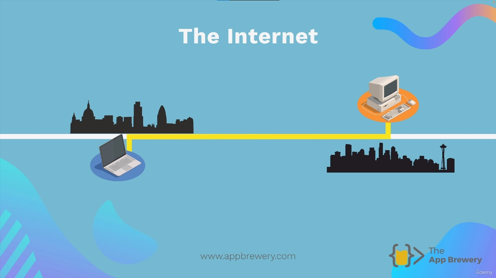
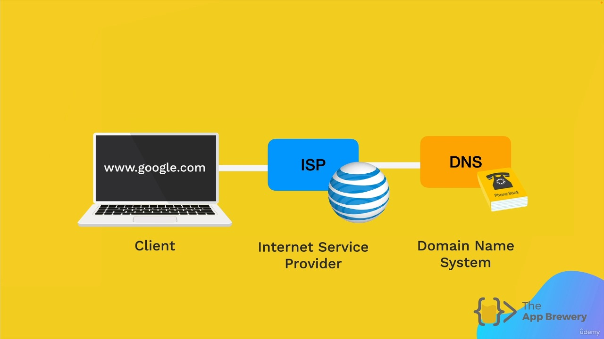
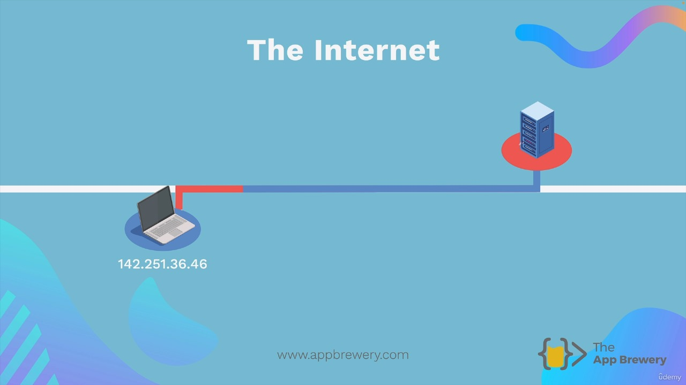
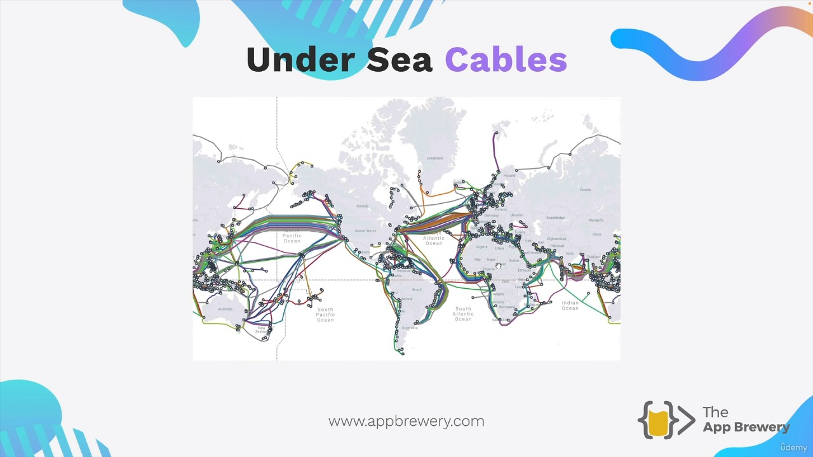

# How does Internet actually work?

## What is the Internet?

Many people think of the internet as a complex cloud, but in reality, it's quite simple. The internet is essentially a long piece of wire that connects different computers to each other. These computers, spread across the world, communicate and transfer data through this giant wire.

## Servers and Clients

Some computers connected to the internet have a special job; they need to be online 24/7 to serve users with data and files when they access websites. We call these computers "servers." On the other hand, the computers that users like you and me use to access the internet are called "clients."

Think of a web server as a giant library that's always open. You can request to see websites like Google's homepage or the latest post on Techcrunch, and the server will provide you with the necessary files and data.

## How Data Moves on the Internet

Imagine the internet as a massive library. If it's large enough, finding what you need quickly can be challenging. So how does this problem get solved on the internet?

When you type in a website URL, like google.com, your browser sends a message to your internet service provider (ISP), such as AT&T or Comcast in the US or BT or Talk Talk in the UK. The ISP then relays your request to a DNS server (Domain Name System server), which acts like a phonebook. 

It looks up the exact IP address of the website you want to access. Every computer connected to the internet has a unique IP address, allowing them to be located.

Once the DNS server finds the IP address, it sends it back to your browser. Now you know the exact address of the Google homepage. Your browser then sends a direct request to that address through your ISP and the internet backbone.

The internet backbone is a network of cables, both underwater and above ground, connecting all internet users worldwide. Your request might travel across the Atlantic Ocean through these cables to reach the United States. The server located at that address (e.g., 216.58.210.46, which is Google's server) receives your request and sends back all the relevant data through the internet backbone.

To navigate this complex network, you rely on the IP address, much like sending a letter worldwide with just the postal address on the envelope. All of this happens in a matter of milliseconds, and your browser displays the requested webpage.

