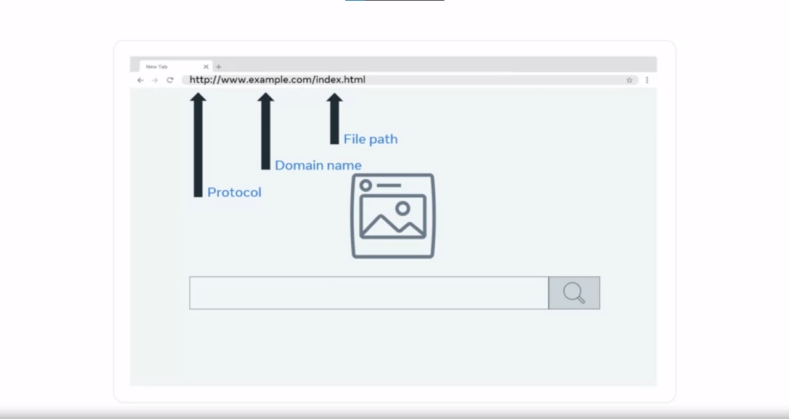

# Web Browser

A web browser, often simply referred to as a browser, is a software application that facilitates the process of accessing and interacting with the World Wide Web. This document will provide a detailed overview of how a web browser works, from sending requests to receiving and displaying content.

## Request-Response Cycle

At its core, a web browser functions through a series of request-response cycles. Here's how it operates:

1. **Address Bar and URL**:
   When you open a web browser, you are presented with an address bar. This is where you input the address of the website you want to visit. The address is commonly known as the Uniform Resource Locator (URL). A typical URL consists of:
   - The protocol (usually HTTP)
   - The domain name (the website's name)
   - The file path (the specific page you wish to view)

   

2. **HTTP Protocol**:
   When you enter a URL and hit Enter, the web browser communicates with a web server using the Hypertext Transfer Protocol (HTTP).

3. **Web Server Interaction**:
   The browser sends a request across a network to a web server, which is essentially another computer on the internet. The web server is designed to process requests and provide data in response.

4. **Response and Webpage Rendering**:
   The web server sends back a response containing the requested webpage. This webpage is a coded document that the browser renders, making it visually accessible to the end-user.

5. **Interaction**:
   With the webpage loaded in the browser, you can interact with it as needed. For instance, you can search for information by entering queries into the search bar or clicking on links.

6. **Subsequent Requests**:
   When you perform actions like searching for a phrase, the browser prepares and sends another request to the same web server, including specific instructions.

7. **Data Retrieval**:
   The web server processes your request by searching for the relevant data, often stored in a database connected to the web server. It retrieves this data and sends it back to the browser.

8. **Display of Results**:
   Once the browser receives the full response, it renders a visible webpage containing the requested data. This webpage typically includes links, maps, reviews, lists, and more.

In summary, web browsers enable the exchange of information between your device and web servers by following a request-response cycle. This cycle is crucial for various online activities, including searching the web, chatting with friends, streaming content, and sharing files.

