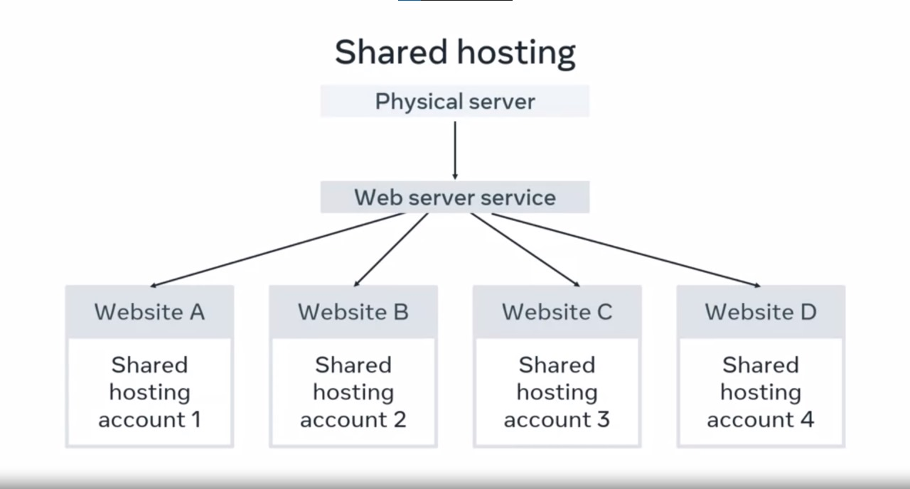
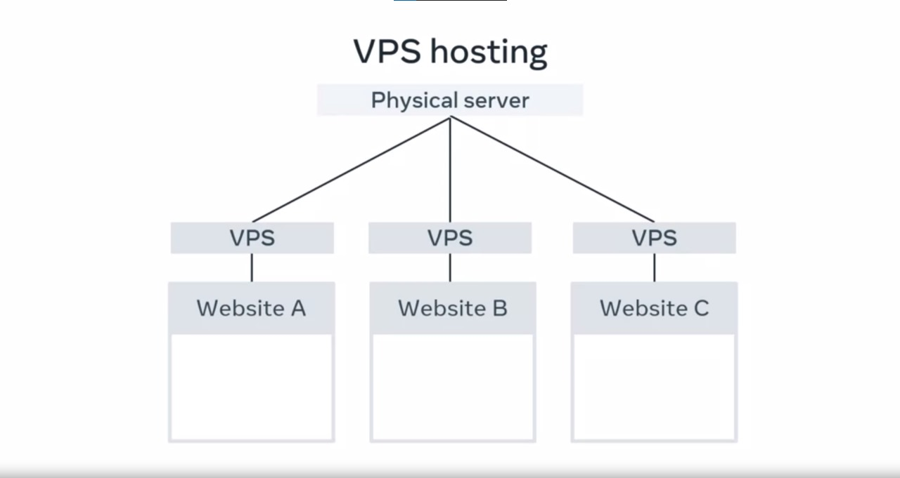
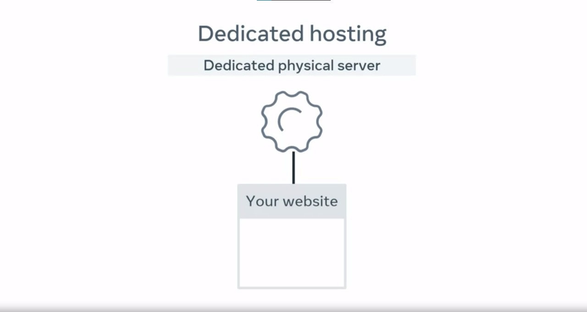
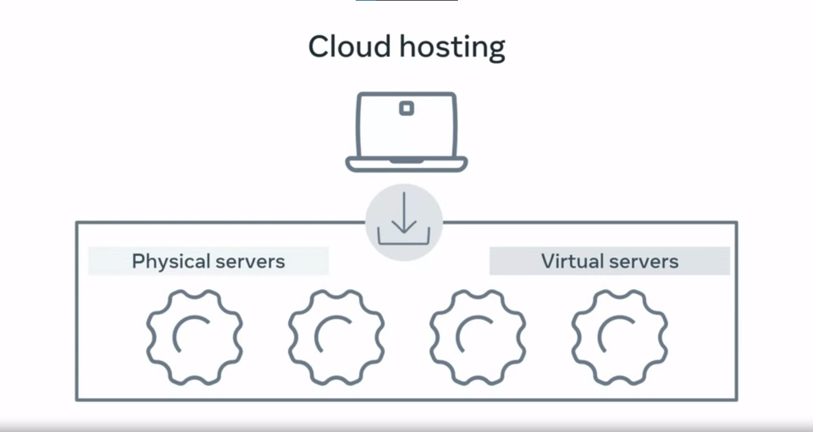

# Web Hosting

Web hosting is a service that allows individuals and businesses to make their websites and files accessible on the internet without the need for owning and managing their own datacenter and specialized hardware. It involves renting storage space on a web server provided by a hosting company in exchange for stable and secure storage. In this documentation, we will explore the different types of web hosting services available to meet various hosting needs.

## Types of Web Hosting Services

There are several types of web hosting services, each catering to different requirements and budgets. These hosting options include:

### 1. Shared Hosting

Shared hosting is the most affordable form of web hosting. With shared hosting, you pay for a space on a web server that is shared with many other hosting accounts. Sharing resources like processing power, memory, and bandwidth can sometimes affect website performance. This option is suitable for small websites with a limited number of visitors. Some providers offer free shared hosting, but it often comes with limitations and embedded advertisements on webpages.

### 2. Virtual Private Server (VPS) Hosting

Virtual Private Server (VPS) hosting provides a more robust hosting environment compared to shared hosting. A VPS is a virtual server that offers dedicated CPU, memory, and bandwidth resources. It runs on a hardware server alongside other VPS instances, but the allocated resources are fixed per VPS instance. This ensures that your website's performance is less likely to be affected by other VPS instances. VPS hosting is a more expensive option than shared hosting.

### 3. Dedicated Hosting

Dedicated hosting provides a hardware server dedicated exclusively to your website or application. In this hosting type, all hardware resources, including CPU, memory, and bandwidth, are entirely at your disposal. Dedicated hosting offers optimal performance and control but is typically more expensive than VPS hosting.

### 4. Cloud Hosting

Cloud hosting has gained popularity over the last decade and offers a flexible and scalable hosting solution. With cloud hosting, your website is hosted in a "Cloud" environment that spans multiple physical and virtual servers. If one server fails, your website automatically switches to another server, ensuring continuous uptime. Cloud hosting allows you to scale your resources as needed without hardware limitations, making it ideal for growing websites and applications. However, you pay based on the resources you use, including bandwidth and storage, which can become costlier as your site's popularity grows.

