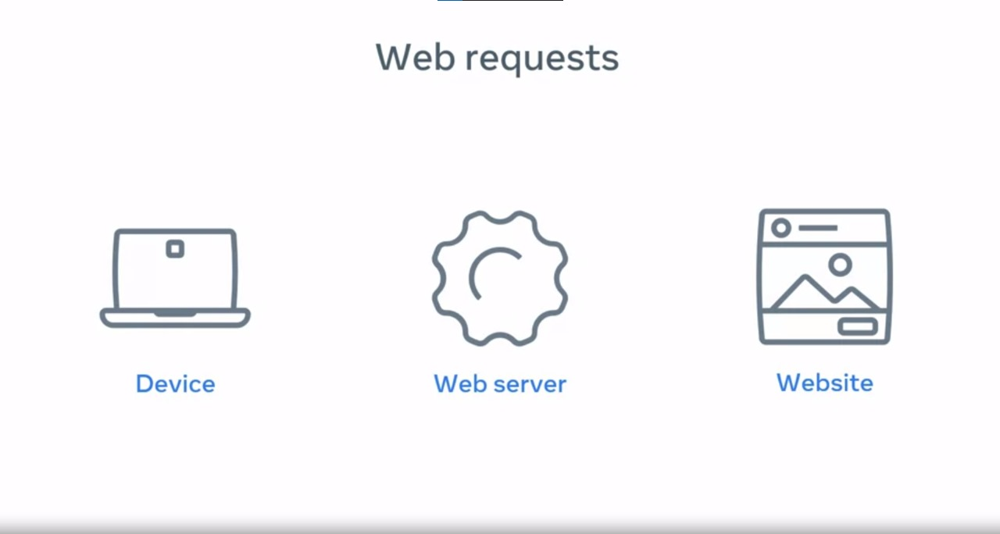

# Web Server

A **web server** is a specialized computer that runs applications and services, catering to various needs such as websites and instant messaging. It is aptly named a "server" because it provides services to other computers, known as clients. Typically housed in data centers alongside hundreds or thousands of other servers, these servers are interconnected and maintained round the clock. Data centers are distributed globally, ensuring users can access content quickly from the nearest server.

## Server Hardware and Software

### Server Hardware

Servers are tailored based on their intended purpose. For instance, a server designated for image storage requires ample hard drive space, while a server performing complex calculations needs a robust processor and substantial memory. These physical components collectively constitute **server hardware**. Once installed in a data center, hardware configurations remain relatively static and require physical replacement for upgrades or changes.

### Server Software

Contrasting hardware, **server software** is dynamic and easily modifiable. It refers to the code that runs on the server, facilitating various functionalities. When software needs to be altered or updated, it involves replacing the code, making it a seamless process. 

## Web Servers: A Specific Type

Within the realm of servers, a crucial category is **web servers**. They serve multiple functions, including website storage and administration, data storage, security management, and email handling. One of their pivotal roles is managing **web requests**.

### Web Request-Response Cycle

When a user opens a browser and enters a website's name, the web server's task is to send back the requested content. This reciprocal process, known as the **request-response cycle**, is fundamental to web servers. Web servers are optimized to handle thousands of requests from clients per second, ensuring swift and seamless user experiences.

## Conclusion

In summary, a web server encompasses both hardware and software components. The hardware, the tangible and static part, forms the physical structure of the server, while the software, malleable and dynamic, constitutes the code that runs on it. Web servers, as a specific type, play a pivotal role in the digital landscape, efficiently managing web requests and delivering content to users globally. Understanding this intricate interplay between hardware and software is fundamental to comprehending the functionality of web servers in the modern digital age.