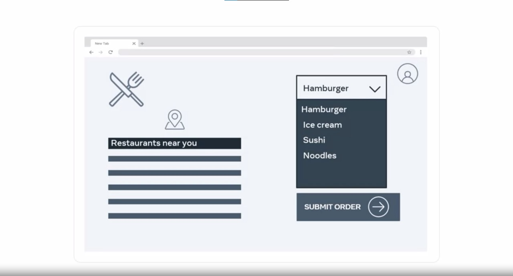

# Websites vs. Web Applications

When it comes to online content, you're likely to encounter web pages, websites, and web applications. These terms can sometimes be used interchangeably, but there are distinct differences that can help you understand and decide which one to create as a developer. Let's explore the primary features of each, drawing from the text above:

 

## Web Pages
A typical web page is a single HTML document that includes CSS and JavaScript. It is primarily responsible for displaying static content, such as text, images, videos, and more, in a web browser. These pages are independent and do not interact with the user beyond what's presented on the page itself.

 

## Websites
A website is a collection of web pages that are linked together under a common domain name. When you visit a website, such as an encyclopedia site, you'll find a homepage with numerous links to various articles. Clicking on these links takes you to new web pages, and those pages may have additional links to more content. The key characteristic of a website is that all these web pages exist under the same domain name. In technical terms, the links you click on within a website are known as hyperlinks, as they lead to hypertext content.

### Key Points:
- Websites are made up of multiple web pages.
- They share a common domain name.
- Hyperlinks connect the pages within the same website.
- Websites are generally informative and present static content.

 In contrast, a company website typically provides static information about the organization and its services. The content remains the same for every visitor, and users primarily consume information without significant interaction.

 

## Web Applications
A web application blurs the line between a website and a web page. The main distinction is the level of interactivity and dynamic content. Think of a web application as a more user-centric and interactive experience. 

For example, consider the process of ordering food online. When you visit a food delivery site, the browser displays a web page. You can select items from the menu and submit your order. In this scenario, the content displayed is specific to your user account and location, and it changes based on your interactions. This dynamic behavior characterizes web applications.

### Key Points:
- Web applications offer a high level of interactivity.
- They display dynamic content based on user input and interactions.
- Examples of web applications include online shopping platforms, social media, and productivity tools.

## Summary 
In summary, web pages are individual, static documents, while websites are collections of interconnected web pages under a single domain. Web applications, on the other hand, provide a more interactive and dynamic user experience. Understanding these distinctions is crucial for developers to choose the appropriate format based on the specific needs of their project.